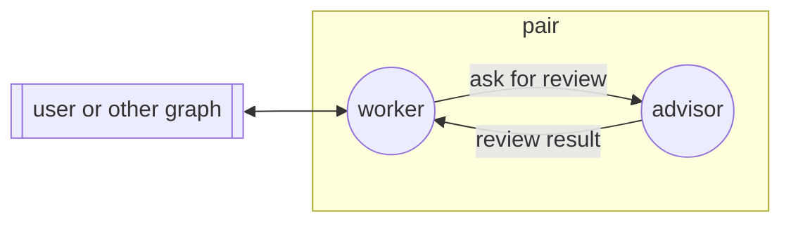

## Boundaries

- No communication with nodes outside the graph, except through `external`.
- Graph management (`/graph-up`, `/graph-down`, `/node-invite`, `/node-down`)
  is permitted with any gossip peer.
- No file changes outside the git branch of the graph.
- Reading files outside the working tree is permitted. No file changes
  outside the working tree.
- The two nodes work on the same host, in the same working tree.

## Edges

### ask-review

The worker sends the plan, or the diff from the base commit, to the advisor.
Then it waits for `review-result`.

### review-result

The advisor sends its findings to the worker, one per line, the most severe
first. Each finding has a severity: `blocker`, `concern`, or `nit`.

### external

All messages from and to the user or other graphs go through the worker. The
worker gives the final result to the user.
