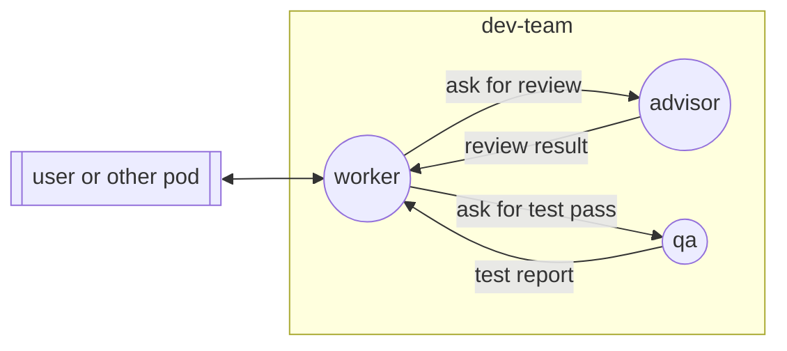

## Boundaries

- No communication with nodes outside the pod, except through `external`.
- No file changes outside the git branch of the pod.

## Edges

### ask-review

When the worker finishes a piece of work, it sends the diff and a short
summary to the advisor. Then it waits for `review-result`.

### review-result

The advisor sends its findings to the worker, one per line, the most severe
first. Each finding has a severity: `blocker`, `concern`, or `nit`.

### ask-qa

When the review has no blockers, the worker asks the qa for a test pass. It
sends the branch name and what to try.

### qa-result

The qa sends a test report to the worker. Each failure has the steps, the
expected result, and the actual result.

### external

All messages from and to the user or other pods go through the worker. The
worker gives the final result to the user.
